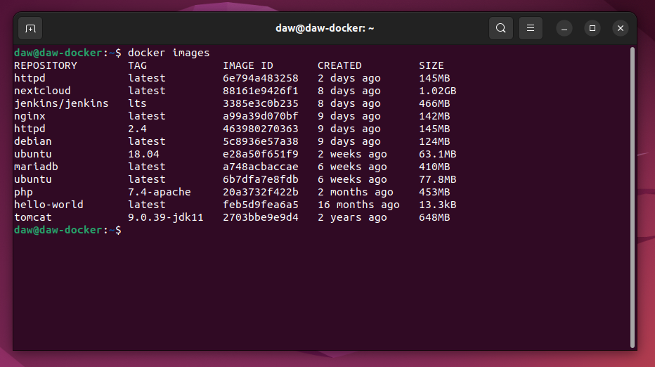
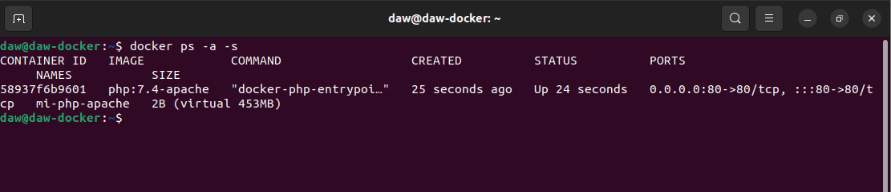

#### 1. Descarga las siguientes imágenes: ubuntu:18.04, httpd, tomcat:9.0.39-jdk11,jenkins/jenkins:lts, php:7.4-apache.

> En las siguientes capturas se van a ver la instalación de las imagenes y luego la comprobación de la instalación.


```sh
"Instalación de las imagenes"
docker run ubuntu:18.04
docker run tomcat:9.0.39-jdk11
docker run jenkins/jenkins:lts
docker run php:7.4-apache
```


#### 2. Muestras las imágenes que tienes descargadas.

```sh
"Ver todas las imagenes instaladas"
docker images
```




#### 3. Crea un contenedor demonio con la imagen php:7.4-apache

```sh
docker run -d --name mi-php-apache -p 80:80 php:7.4-apache
```


#### 4. Comprueba el tamaño del contenedor en el disco duro.

```sh
docker ps -a -s
```



#### 5. Con la instrucción docker cp podemos copiar ficheros a o desde un contenedor. Crea un fichero en tu ordenador, con el siguiente contenido: "" Copia un fichero info.php al directorio /var/www/html del contenedor con docker cp.

> Creamos el archivo en el repositorio local.

```sh
sudo touch info.php
sudo nano info.php
```


> Copiamos el fichero en nuestro contenedor.

```sh
docker cp ~/info.php mi-php-apache:/var/www/html
```


> Comprobamos en nuestro navegador la salida de nuestro fichero.


#### 6. Vuelve a comprobar el espacio ocupado por el contenedor.

```sh
docker ps -a -s
```

