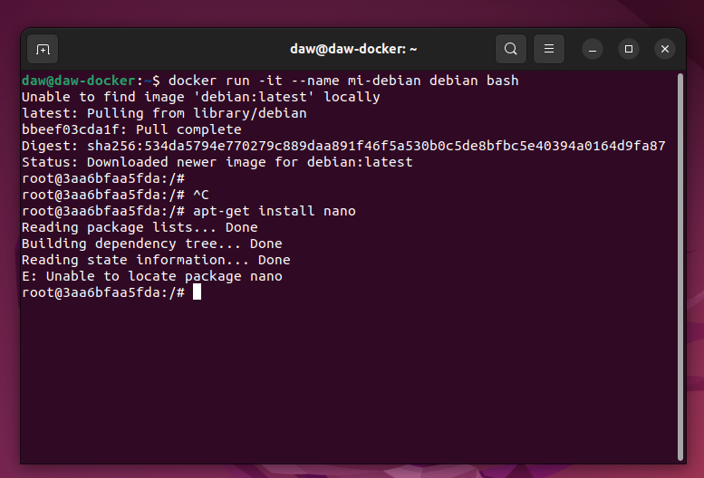

# Actividad 3.02 - Tarea Docker
📌Módulo: Despliegue de Aplicaciones Web

> Realizado por: David Fernandez Vicente

#### 1. Instala docker en una máquina y configúralo para que se pueda usar con un usuario sin privilegios. 

> En este primer ejercicio no se pudo realizar las capturas pertinentes ya que la profesora nos dio la máquina con la siguinte instalación del Docker.
Lo que si que he llegado a hacer es una previa investigación sobre la configuración para que esta pueda ser usado por un usuario sin privilegios.

> Con el siguiente comando se puede usar Docker sin privilegios de root. Después de la ejecución de esta es necesario reiniciar para que los cambios surtan su efecto.

```sh
sudo usermod -aG docker $USER
```

#### 2. Ejecuta un contenedor a partir de la imagen hello-word. Comprueba que nos devuelve la salida adecuada. Comprueba que no se está ejecutando. Lista los contenedores que estánparado. Borra el contenedor.

> Comprobacion que tenemos la imagen en nuestro docker.

```sh
docker images
```


> En la primera captura se puede ver que estamos ejecutando un contenedor a partir de la imagen hello-world.

```sh
docker run hello-world
```


> Se puede ver que el contenedor con dicha imagen no se esta ejecutando. Con este comando se puede listar todos los contenedores y su estado.

```sh
docker ps -a
```


> En la ultima captura borramos el contenedor cuya imagen es la de hello-world. Y luego volvemos a mostrar toda la lista de las imagenes para comprobar su borrado.


```sh
En mi caso he borrado el contendor por su id.

docker rm cfe3c6b48465

docker ps -a
```


#### 3. Crea un contenedor interactivo desde una imagen debian. Instala un paquete (por ejemplo nano). Sal de la terminal, ¿sigue el contenedor corriendo? ¿Por qué?. Vuelve a iniciar el contenedor y accede de nuevo a él de forma interactiva. ¿Sigue instalado el nano?. Sal del contenedor, y bórralo. Crea un nuevo contenedor interactivo desde la misma imagen. ¿Tiene el nano instalado?

> Creamos un contenedor interactivo con la imagen debian.

```sh
docker run -it --name mi-debian debian bash

"El comando '< apt-get install nano >' es un fallo mio, en las siguientes capturas se puede ver que esta instalado correctamente."
```



> En esta captura hemos actualizado el contenedor para su posterior instalacion del paquete nano.

```sh
apt update
```


> En la siguiente captura se puede ver correctamente la instalacion del paquete nano y su posterior comprobacion de su instalacion.

```sh
apt install nano
nano --version
```


> Al salir de la terminal, el contenedor cuya imagen es la de debian no seguia corriendo. Pero si el contenedor de la imagen debian esta encendido y no salimos ni del contenedor ni cerramos la terminal este seguirá funcionando.

> Volvemos a iniciar el contenedor y accedemos de forma interactiva y el paquete nano sigue instalado en nuestro contenedor.


> Y por ultimo borramos el contenedor y creamos un nuevo contenedor  interactivo con la misma imagen pero el nano no esta instalado en este nuevo contenedor.

```sh
"Con este comando se borra el contenedor"
docker rm <nombre_contenedor>
```


#### 4. Crea un contenedor demonio con un servidor nginx, usando la imagen oficial de nginx. Al crear el contenedor, ¿has tenido que indicar algún comando para que lo ejecute? Accede al navegador web y comprueba que el servidor esta funcionando. Muestra los logs del contenedor.

> En esta primera captura se puede ver que hemos creado un contenedor demonio con una imagen nginx

```sh
docker container run --name mi-nginx -p 80:80 nginx
```


> Comprobación de que nuestro contenedor esta funcionando en el navegador web.


> Mostramos los logs del contenedor de nuestra imagen nginx.

```sh
docker logs mi-nginx
```


#### 5. Crea un contenedor con la aplicación Nextcloud, para personalizar el nombre de la base de datos sqlite que va a utilizar.

> En esta captura se puede observar que hemos creado un contenedor con la applicacion NextCloud.

```sh
docker run -d --name mi-nextcloud -e SQLITE_DATABASE=davidDB nextcloud


"En este comando lo que hacemos es ver todas las variables de entorno de ese contenedors"
docker exec -it mi-nextcloud env
```


Applicacion NextCloud desplegada en el navegador


