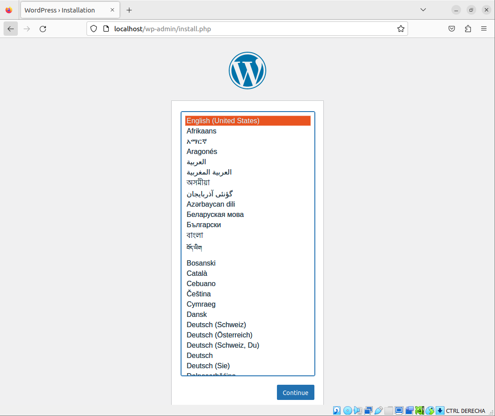

# Actividad 4.02 - Tarea Redes
📌Módulo: Despliegue de Aplicaciones Web


> Realizado por David Fdez Vicente

### 1. Depliegue la aplicacion GuestBook.

> Lo primero de todo creamos la red en a que se va a encontrar tanto el servicio web como el servicio de la base de datos.

```sh
docker network create red_guestbook
```


> Lo segundo creamos los contenedores donde van a estar a estar tanto el servicio web como la base de datos y la ejecutamos.

```sh
docker run -d --name redis --network red_guestbook redis
docker run -d -p 80:5000 --name guestbook --network red_guestbook
iesgn/guestbook
```


> Para acabar se comprueba de que la aplicacion esta funcionando por el puerto 80  y solo basta con escribir en el navegador 'localhost'.


### 2. Despliegue de la aplicación de la Temperatura.

> Lo primero que hay que hacer es crear una red especifica para la aplicacion de la temperatura.

```sh
docker network create red_temperaturas
```


> A continuacion lo que se tiene que hacer es crear los contenedores donde el primero va a estar el servicio frontend y el segundo va a estar el servicio backend. 

```sh
docker run -d --name temperaturas-backend --network red_temperaturas iesgn/temperaturas_backend
docker run -d -p 80:3000 --name temperaturas-frontend --network
red_temperaturas iesgn/temperaturas_frontend
```


### 3. Despliegue de Wordpress + MariaDB.

> El primer paso que hay que hacer es nuevamente crear una red para este ejercicio.

```sh
docker network create red_wordpress-mariadb
```


> En el siguiente paso lo que se haria es crear los contenedores tanto para mariadb como para wordpress.

```sh
'MariaDB'
docker run -d --name servidor_mysql \
--network red_wordpress-mariadb \
-v /opt/mysql_wp:/var/lib/mysql \
-e MYSQL_DATABASE=bd_david \
-e MYSQL_USER=user_david \
-e MYSQL_PASSWORD=david \
-e MYSQL_ROOT_PASSWORD=david \
mariadb

'WordPress'
docker run -d --name servidor_wp \
--network red_wordpress-mariadb \
-v /opt/wordpress:/var/www/html/wp-content \
-e WORDPRESS_DB_HOST=servidor_mysql \
-e WORDPRESS_DB_USER=user_david \
-e WORDPRESS_DB_PASSWORD=david \
-e WORDPRESS_DB_NAME=bd_david \
-p 80:80 \
wordpress
```





