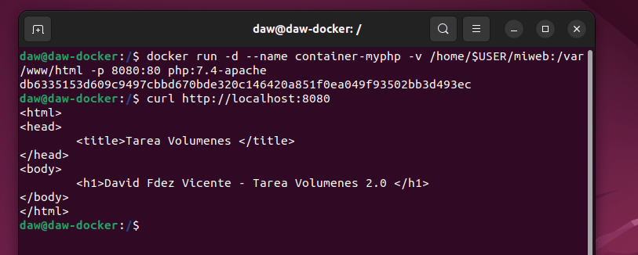

# Actividad 4.02 - Tarea Docker- Volúmenes
📌Módulo: Despliegue de Aplicaciones Web


> Realizado por David Fdez Vicente

#### 1. Contenedor nextcloud conalmacenamiento persistente.


```sh
"Creamos el volumen para el nextcloud"
docker volume create nextcloud

"Creamos el contenedor y lo guardamos en ese directorio"
docker run -d -p 80:80 -v nextcloud:/var/www/html --name contenedor_nextcloud nextcloud
```

> Comprobamos que en nuestro servidor este funcionando la applicacion de nextcloud


### Ejercicios:
* Volúmenes:

    ### 1. Crear un volumen docker que se llame miweb.
    
    > Creamos un volumen en docker que se llame miweb.
    
    ```sh
    docker volume create miweb
    ```
    
    
    
    ### 2. Crea un contenedor desde la imagen php:7.4-apache donde montes en el directorio/var/www/html (que sabemos que es el DocumentRoot del servidor que nos ofrece esaimagen) el volumen docker que has creado.
    
    > Creamos un contenedor activo con la imagen php:7.4-apache y con el respectivo directorio /var/www/html
    
    ```sh
    docker run -d --name contenedor-miweb -v miweb:/var/www/html php:7.4-apache
    ```
    
    
    
    ### 3.  Utiliza el comando docker cp para copiar un fichero index.html en el directorio/var/www/html.
    
    > Creamos el ficher index.html y posteriori copiamos el fichero en la ruta /var/www/html.
    
    ```sh
    docker cp /index.html contenedor-miweb:/var/www/html
    ```
    
    
    > Iniciamos el contenedor y comprobamos que se ha copiado bien el fichero.
    
    ```sh
    docker start contenedor-miweb
    docker exec -ti contenedor-miweb /bin/bash
    ```
    
    > Dentro del contenedor hacemos un ls para comprobar el contenido que hay en /var/www/html.
    
    > Salimos del contenedor con el comando  exit y comprobamos que el fichero también está donde lo creamos, ls.
    
    
    
    ### 4. Accede al contenedor desde el navegador para ver la información ofrecida por el ficheroindex.html.
    
    > Entramos en el contenedor con este comando
    
    ```sh
    docker exec -ti contenedor-miweb /bin/bash
    "Y comprobamos el contenido que tiene el fichero"
    cat index.html
    ```
    
    
    ### 5. Borra el contenedor.
    
    > Primero comprobamos que el contenedor está parado para cerrarlo. Al estar en corriendo paramos el contenedor. Y por ultimo, borramos el contenedor.
    
    ```sh
    docker ps -a
    docker stop contenedor-miweb
    docker rm contenedor-miweb
    ```
    
    
    
    ### 6. Crea un nuevo contenedor y monta el mismo volumen como en el ejercicio anterior. Accede al contenedor desde el navegador para ver la información ofrecida por el ficheroindex.html. ¿Seguía existiendo ese fichero?
    
    
    > Volvemos a crear el contenedor con el mismo volumen y comprobamos que se ha creado.
    
    ```sh
    docker run -d --name contenedor-miweb -v miweb:/var/www/html php:7.4-apache
    docker ps -a
    ```
    
    > Para la segunda pregunta si sigue existiendo el fichero porque se borra el contenedor no el volumen.
    
    
    
* Bind Mount:

    ### 1. Crea un directorio en tu host y dentro crea un fichero index.html.
    
    > Creamos el directorio y accedemos a él. Despues de eso nos creamos un fichero index.html.
    
    ```sh
    mkdir miweb
    cd miweb/
    nano index.html
    ```
    
    
    
    
    
    ### 2. Crea un contenedor desde la imagen php:7.4-apache donde montes en el directorio /var/www/html el directorio que has creado por medio de bind mount.
    
    > Creamos el contenedor con esa imagen y en ese directorio.
    
    ```sh
    docker run -d --name container-php -v /home/$USER/miweb:/var/www/html -p 8080:80 php:7.4-apache
    
    "Hacemos un curl a nuestra ip para ver la salida"
    
    curl http://localhost:8080
    ```
    
    
    
    ### 3. Accede al contenedor desde el navegador para ver la información ofrecida por el fichero index.html.
    
    
    
    ### 4. Modifica el contenido del fichero index.html en tu host y comprueba que al refrescar la página ofrecida por el contenedor, el contenido ha cambiado.
    
    > Modificamos el fichero index.html del directorio y comprobamos que se han realizado lo cambios.
    
    ```sh
    nano /home/daw/miweb/index.html
    ```
    
    
    ###♣ 5. Borra el contenedor.
    
    > Borramos el contenedor, si lo borrasemos corriendo con el contenedor seria con el -f.
    
    ```sh
    docker stop container-myphp
    docker rm container-myphp
    (docker rm -f container-myphp)
    ```
    
    
    
    ### 6. Crea un nuevo contenedor y monta el mismo directorio como en el ejercicio anterior.
    
    ```sh
    docker run -d --name container-php -v /home/$USER/miweb:/var/www/html -p 8080:80 php:7.4-apache
    ```
    
    ### 7. Accede al contenedor desde el navegador para ver la información ofrecida por el fichero index.html. ¿Se sigue viendo el mismo contenido?
    
    > Si, porque el volumen no se ha borrado y la información es persistente.
    
    

    