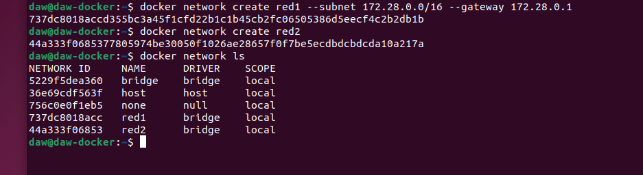
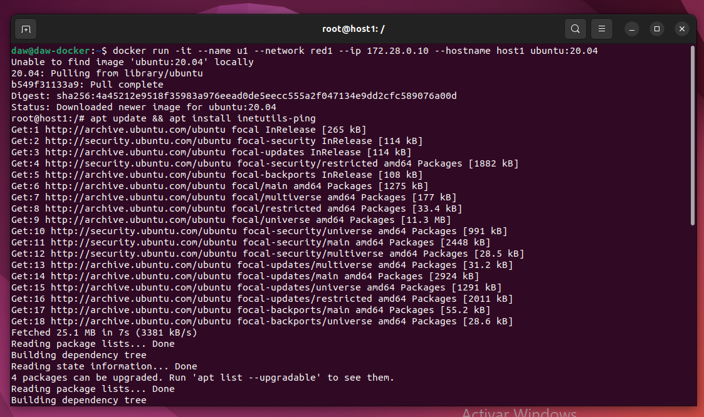
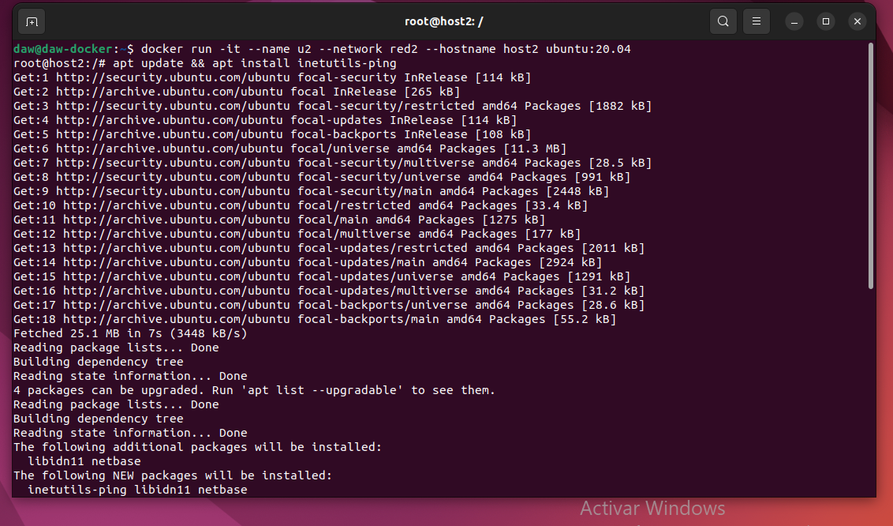
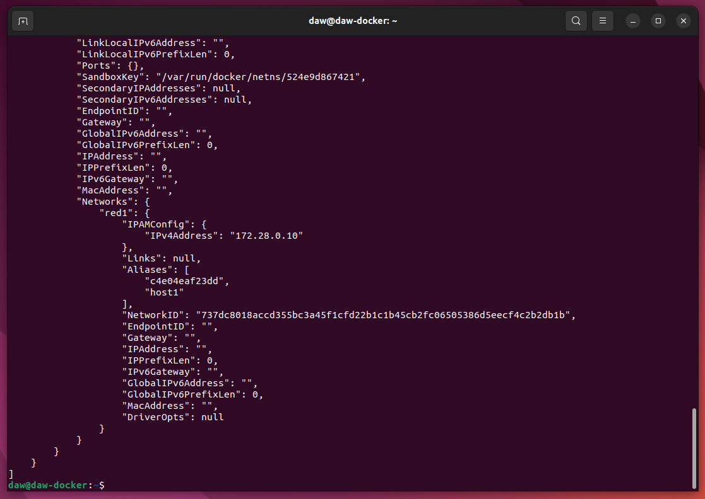
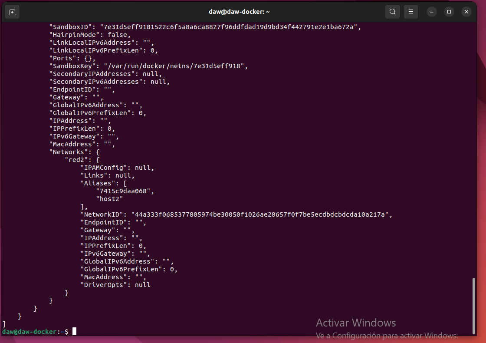
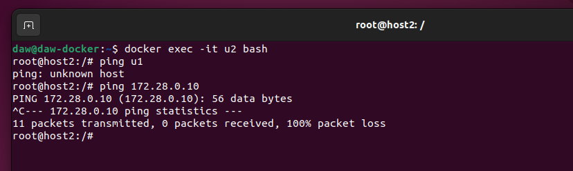
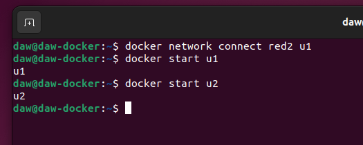
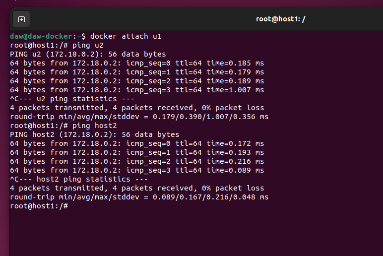

## Actividad 5.01 - Tarea Redes Avanzado

📌 Módulo: Despliegue de Aplicaciones Web
 
> Realizado por David Fdez Vicente


#### 1. Vamos a crear dos redes de ese tipo (BRIDGE) con los siguientes datos:
```sh
 Red1:
    - Nombre: red1 
    - Dirección de red: 172.28.0.0
    - Máscara de red: 255.255.0.0
    - Gateway: 172.28.0.1
    
Red2:
    - Nombre: red2
    - Es resto de los datos será proporcionados automáticamente por Docker.
```

> En la primera imagen que nos encontramos es la creación de las redes tanto de la red1 como de la red2 con los datos pertinentes.

```sh
    docker network create red1 --subnet 172.28.0.0/16 --gateway 172.28.0.1
    docker network create red2
    docker network lss
```



#### 2. Poner en ejecución un contenedor de la imagen ubuntu:20.04 que tenga como hostname host1, como IP 172.28.0.10 y que esté conectado a la red1. Lo llamaremos u1.

> En la siguiente captura vemos la ejecución del contenedor con su respectiva imagen, ip, hostname y que ademas de eso que este conectado a la red1.

```sh
docker run -it --name u1 --network red1 --ip 172.28.0.10 --hostname host1 ubuntu:20.04
```

> Al crearse el contenedor accedemos a este y ejecutamos el comando 'apt update && apt install inetutils-ping'




#### 3. Poner en ejecución un contenedor de la imagen ubuntu:20.04 que tenga como hostname host2 y que esté conectado a la red2. En este caso será docker el que le de una IP correspondiente a esa red. Lo llamaremos u2.

```sh
docker run -it --name u2 --network red2 --hostname host2 ubuntu:20.04
```




#### Apartados de ampliación.

* Pantallazo donde se vea la configuración de red del contenedor u1.
    
    ```sh
    docker inspect u1
    ```
    
    
    
* Pantallazo donde se vea la configuración de red del contenedor u2.

    ```sh
    docker inspect u2
    ```

    
    
* Pantallazo donde desde cualquiera de los dos contenedores se pueda ver que no podemos hacer ping al
otro ni por ip ni por nombre.

    ```sh
    docker exec -it u2 bash
    ```

    
    
* Pantallazo donde se pueda comprobar que si conectamos el contenedor u1 a la red2 (con docker
network connect ), desde el contenedor u1, tenemos acceso al contenedor u2 mediante ping, tanto
por nombre como por ip.

    ```sh
    docker network connect red2 u1
    docker start u1
    docker start u2
    ```

    
    
    ```sh
    docker attach u1
    ```
    
    

